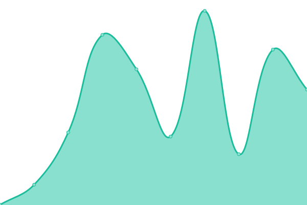

# [📈 Live Status](https://yuimatcha.github.io/uptime): <!--live status--> **🟩 All systems operational**

This repository contains the open-source uptime monitor and status page for [Farid Nizam](www.onolune.me), powered by [Upptime](https://github.com/upptime/upptime).

With [Upptime](https://upptime.js.org), you can get your own unlimited and free uptime monitor and status page, powered entirely by a GitHub repository. We use [Issues](https://github.com/yuimatcha/uptime/issues) as incident reports, [Actions](https://github.com/yuimatcha/uptime/actions) as uptime monitors, and [Pages](https://yuimatcha.github.io/uptime) for the status page.

<!--start: status pages-->
<!-- This summary is generated by Upptime (https://github.com/upptime/upptime) -->
<!-- Do not edit this manually, your changes will be overwritten -->
<!-- prettier-ignore -->
| URL | Status | History | Response Time | Uptime |
| --- | ------ | ------- | ------------- | ------ |
|  [Personal Website](https://www.onolune.me) | 🟩 Up | [personal-website.yml](https://github.com/yuimatcha/uptime/commits/HEAD/history/personal-website.yml) | 

 285ms
     
 | 

<a href="https://yuimatcha.github.io/uptime/history/personal-website">100.00%</a>
    

|  [Analytics](https://ovra.vercel.app) | 🟩 Up | [analytics.yml](https://github.com/yuimatcha/uptime/commits/HEAD/history/analytics.yml) | 

 166ms
     
 | 

<a href="https://yuimatcha.github.io/uptime/history/analytics">100.00%</a>
    

|  Node 1 | 🟩 Up | [node-1.yml](https://github.com/yuimatcha/uptime/commits/HEAD/history/node-1.yml) | 

 7ms
     
 | 

<a href="https://yuimatcha.github.io/uptime/history/node-1">100.00%</a>
    

|  Node 2 | 🟩 Up | [node-2.yml](https://github.com/yuimatcha/uptime/commits/HEAD/history/node-2.yml) | 

 5ms
     
 | 

<a href="https://yuimatcha.github.io/uptime/history/node-2">100.00%</a>
    

|  Node 3 | 🟩 Up | [node-3.yml](https://github.com/yuimatcha/uptime/commits/HEAD/history/node-3.yml) | 

 6ms
     
 | 

<a href="https://yuimatcha.github.io/uptime/history/node-3">100.00%</a>
    

|  Mail Server | 🟩 Up | [mail-server.yml](https://github.com/yuimatcha/uptime/commits/HEAD/history/mail-server.yml) | 

 132ms
     
 | 

<a href="https://yuimatcha.github.io/uptime/history/mail-server">100.00%</a>
    

|  Mail Server (MX Record) | 🟩 Up | [mail-server-mx-record.yml](https://github.com/yuimatcha/uptime/commits/HEAD/history/mail-server-mx-record.yml) | 

 0ms
     
 | 

<a href="https://yuimatcha.github.io/uptime/history/mail-server-mx-record">100.00%</a>
    

<!--end: status pages-->

[**Visit our status website →**](https://yuimatcha.github.io/uptime)

## 📄 License

- Powered by: [Upptime](https://github.com/upptime/upptime)
- Code: [MIT](./LICENSE) © [Farid Nizam](www.onolune.me)
- Data in the `./history` directory: [Open Database License](https://opendatacommons.org/licenses/odbl/1-0/)
